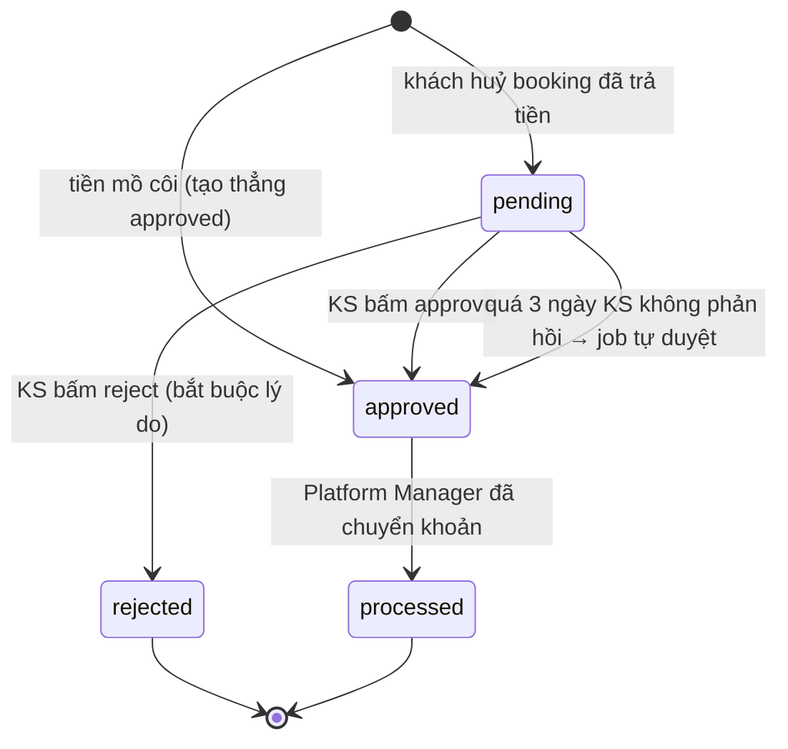

# Refund API — Spec cho FE

> **Nguồn**: đọc trực tiếp code BE trên branch `feat/integrate-api-refund`
> (`server/src/routes/v1/hotel.route.ts`, `platform-manager.route.ts`,
> `services/refund.service.ts`, `validations/refund.validation.ts`,
> `prisma/schema.prisma` → `model Refund`).
> BE **đã làm xong và đã có Swagger** (`/v1/docs`, tag `Refunds`). Tài liệu này là bản
> tóm tắt dành cho FE: shape thật, quyền, lỗi, và scaffolding theo đúng convention của `client/`.

---

## 1. Nghiệp vụ — vì sao tách làm 2 màn hình

Tiền khách trả **nằm ở tài khoản của platform** (mô hình escrow). Ví khách sạn chỉ là con số
ghi sổ — khách sạn **không cầm tiền** nên không thể tự hoàn.

| Bên                  | Việc                                | Endpoint                                          |
| -------------------- | ----------------------------------- | ------------------------------------------------- |
| **Khách sạn**        | Quyết định **CÓ hoàn hay không**    | `PATCH /hotels/:hotelId/refunds/:refundId/review`  |
| **Platform Manager** | **Thực thi** chuyển khoản + đối soát | `PATCH /platform-manager/refunds/:refundId/process` |

Duyệt (`approved`) **không làm tiền dịch chuyển**. Tiền chỉ thực sự rời khỏi khách sạn ở bước
`process`: BE đặt refund → `processed`, Payment → `refunded` (nếu hoàn 100%), tính lại hoa hồng
trên phần khách sạn **thực giữ**, và trừ ví khách sạn phần net chênh lệch — tất cả trong 1 transaction.

### Refund được tạo từ đâu (FE không tạo)

Không có endpoint tạo refund. Refund sinh ra tự động ở BE:

1. **Khách huỷ booking đã thanh toán** (`PATCH /bookings/:id/cancel`) → tiền hoàn tính theo
   **chính sách huỷ của chính khách sạn đó**, tạo Refund `status: 'pending'`.
   Huỷ muộn bị phạt hết (0đ) thì **không** tạo Refund nào.
2. **"Tiền mồ côi"**: tiền vào sau khi booking hết hạn giữ chỗ → tạo thẳng `status: 'approved'`
   (lỗi hệ thống, khách sạn không có gì để xét).

---

## 2. Vòng đời trạng thái



**⏰ Hạn 3 ngày** (`REVIEW_DEADLINE_DAYS = 3`): job chạy theo lịch tự duyệt mọi yêu cầu còn `pending`
quá 3 ngày kể từ `createdAt`. Lý do: số tiền hoàn tính theo **chính sách do chính khách sạn công bố** —
bước duyệt là để xét **ngoại lệ**, không phải quyền phủ quyết. Không có hạn chót thì khách sạn chỉ cần
im lặng là khách không bao giờ lấy được tiền.

Hệ quả cho FE: một yêu cầu đang mở trên màn hình có thể bị job đổi sang `approved` bất cứ lúc nào →
bấm review lúc đó trả **400**. Xử lý: refetch list rồi báo lại.

**Không có** transition `approved → rejected`. Đã duyệt (kể cả tự động) là chốt.

---

## 3. Model `Refund` (response của cả 4 endpoint)

Cả 2 endpoint list và 2 endpoint PATCH đều trả **cùng một shape** (`refundInclude` trong service).

| Field                 | Kiểu                                              | Ghi chú                                                                 |
| --------------------- | ------------------------------------------------- | ----------------------------------------------------------------------- |
| `id`                  | `string` (uuid)                                   |                                                                         |
| `paymentId`           | `string` (uuid)                                   |                                                                         |
| `requestedBy`         | `string` (uuid)                                   | id khách yêu cầu                                                        |
| `amount`              | `string`                                          | **Decimal → string**, vd `"950000.00"`. Số tiền hoàn.                    |
| `reason`              | `string`                                          | Lý do khách huỷ / hoặc câu mô tả tiền mồ côi                            |
| `status`              | `'pending' \| 'approved' \| 'processed' \| 'rejected'` |                                                                    |
| `reviewedBy`          | `string \| null`                                  | `null` + `reviewedAt` có giá trị = **hệ thống duyệt tự động**            |
| `reviewedAt`          | `string \| null` (ISO)                            |                                                                         |
| `rejectionReason`     | `string \| null`                                  | Chỉ có khi `rejected`                                                   |
| `refundTransactionId` | `string \| null`                                  | Mã CK thật, điền ở bước `process`                                       |
| `processedAt`         | `string \| null` (ISO)                            |                                                                         |
| `createdAt`           | `string` (ISO)                                    | **Mốc tính hạn 3 ngày**                                                 |
| `updatedAt`           | `string` (ISO)                                    |                                                                         |
| `requesterUser`       | `{ id, fullName, email, phone: string \| null }`  | Khách yêu cầu hoàn                                                      |
| `reviewer`            | `{ id, fullName } \| null`                        | Người của KS đã duyệt/từ chối                                           |
| `payment`             | xem dưới                                          |                                                                         |

`payment`:

```
{
  id: string
  paymentMethod: 'vnpay' | 'sepay' | 'stripe' | 'cash'
  amount: string            // số khách ĐÃ TRẢ — so với refund.amount để biết hoàn full hay một phần
  paidAt: string | null
  booking: {
    id, bookingCode: string
    checkInDate, checkOutDate: string (ISO)
    totalAmount: string
    status: 'pending'|'confirmed'|'checked_in'|'checked_out'|'cancelled'|'no_show'
    cancelledAt: string | null
    cancellationReason: string | null
    hotel:    { id, name, city }
    roomType: { id, name }
  }
}
```

> Include này đủ để người duyệt ra quyết định **mà không phải gọi thêm API** — không cần fetch booking riêng.

**Hoàn một phần**: `refund.amount < payment.amount`. Khi đó BE **giữ** Payment ở `completed`
(không đổi sang `refunded`) — bản ghi Refund mới là nguồn sự thật.

---

## 4. Endpoints

Base URL: `import.meta.env.VITE_API_URL` (mặc định `http://localhost:5000/v1`). Tất cả cần
`Authorization: Bearer <accessToken>` (axios interceptor đã tự gắn).

### 4.1 `GET /hotels/:hotelId/refunds` — hàng đợi duyệt của khách sạn

**Quyền**: `auth()` (chỉ cần đăng nhập) — phân quyền thật nằm ở `getOperableHotel()`:
chủ KS (`partner.ownerId === user.id`) **hoặc** role có `manageBookings` (`platform_manager`, `admin`)
**hoặc** staff đang được phân công vào KS đó (`hotelStaffAssignment` còn hiệu lực).

**Query params** (đều optional):

| Param   | Kiểu                                                  | Mặc định | Ràng buộc |
| ------- | ----------------------------------------------------- | -------- | --------- |
| `status`| `pending \| approved \| processed \| rejected`         | —        | enum      |
| `limit` | int                                                   | `20`     | 1–100     |
| `page`  | int                                                   | `1`      | ≥ 1       |

**200**:

```json
{ "results": [ /* Refund[] */ ], "page": 1, "limit": 20, "totalPages": 3, "totalResults": 47 }
```

Sort **cố định** `createdAt desc`, không đổi được. Lọc theo KS đi qua `payment → booking → hotelId`.

**Lỗi**: `401` `"Please authenticate"` · `403` `"Forbidden"` · `404` `"Không tìm thấy khách sạn"`.

---

### 4.2 `PATCH /hotels/:hotelId/refunds/:refundId/review` — KS duyệt / từ chối

**Quyền**: giống 4.1.

**Body**:

```ts
{ decision: 'approve' }
// hoặc
{ decision: 'reject', rejectionReason: string }  // ≤ 500 ký tự
```

> ⚠️ **`rejectionReason` là `Joi.forbidden()` khi `decision = 'approve'`** — gửi kèm
> `rejectionReason: ''` hay `null` sẽ bị **400 `"rejectionReason" is not allowed`**.
> Form RHF mặc định luôn trả `''` cho field trống → **phải xoá key trước khi submit**.

**200**: `Refund` đã cập nhật (đầy đủ include).

**Lỗi**:

| Mã    | Message                                             | Khi nào                                  |
| ----- | --------------------------------------------------- | ---------------------------------------- |
| `400` | `"rejectionReason" is not allowed`                  | gửi lý do kèm `approve` (Joi)            |
| `400` | `"rejectionReason" is required`                     | `reject` mà thiếu lý do (Joi)            |
| `400` | `Yêu cầu này đã được xét duyệt rồi`                 | status ≠ `pending` (kể cả job tự duyệt)  |
| `400` | `Yêu cầu vừa được người khác xét duyệt`             | 2 người duyệt cùng lúc — bên kia thắng   |
| `403` | `Forbidden`                                         | không có quyền trên KS                   |
| `404` | `Không tìm thấy yêu cầu hoàn tiền của khách sạn này`| refundId không thuộc hotelId             |

BE dùng `updateMany` có điều kiện `status: 'pending'` → chống race, chỉ một bên thắng.

---

### 4.3 `GET /platform-manager/refunds` — hàng đợi chuyển khoản toàn sàn

**Quyền**: `auth('manageCommissions')` → **chỉ** `platform_manager` + `admin`.

**Query params** (đều optional): `status`, `hotelId` (uuid), `limit` (1–100, mặc định 20), `page` (mặc định 1).

**200**: cùng shape phân trang như 4.1.

**Lỗi**: `401` · `403 "Forbidden"`.

> Dùng `?status=approved` để lấy đúng **hàng đợi cần chuyển khoản**.
> Không có endpoint riêng để đổ dropdown lọc khách sạn — tái dùng `useAdminHotels`
> (`GET /admin/hotels`, PM có quyền `manageHotels`).

---

### 4.4 `PATCH /platform-manager/refunds/:refundId/process` — đánh dấu đã chuyển khoản

**Quyền**: `auth('manageCommissions')`.

**Body**:

```ts
{ refundTransactionId: string }   // bắt buộc, ≤ 100 ký tự, MÃ CK THẬT để đối soát
```

**Gọi SAU KHI đã thực sự chuyển tiền** cho khách. Đây là nơi **duy nhất** tiền rời khỏi khách sạn —
trong 1 transaction BE làm: Refund → `processed`, Payment → `refunded` (nếu hoàn 100%), tính lại
`platformCommission` trên phần KS thực giữ, trừ ví KS phần net chênh lệch.

**200**: `Refund` đã cập nhật.

**Lỗi**:

| Mã    | Message                                                                                       | Khi nào                    |
| ----- | --------------------------------------------------------------------------------------------- | -------------------------- |
| `400` | `"refundTransactionId" is required`                                                           | thiếu mã CK (Joi)          |
| `400` | `Chỉ xử lý được yêu cầu đã DUYỆT (approved). Yêu cầu chờ duyệt phải được khách sạn duyệt trước.` | status ≠ `approved`     |
| `400` | `Yêu cầu này vừa được xử lý`                                                                   | race — bên kia vừa xử lý   |
| `403` | `Forbidden`                                                                                   | không có `manageCommissions` |
| `404` | `Không tìm thấy yêu cầu hoàn tiền`                                                            | sai refundId               |

⚠️ **Không idempotent theo mã CK**: gọi 2 lần với 2 mã khác nhau thì lần 2 trả 400 (đã `processed`).
Nhưng thao tác này **không thể hoàn tác** → nút Process phải qua `ConfirmDialog` + disable khi `isPending`.

---

## 5. Ma trận quyền

| Role               | List KS (4.1) | Review (4.2) | List sàn (4.3) | Process (4.4) |
| ------------------ | ------------- | ------------ | -------------- | ------------- |
| `customer`         | ❌ 403        | ❌ 403       | ❌ 403         | ❌ 403        |
| `staff` (đã gán)   | ✅            | ✅           | ❌ 403         | ❌ 403        |
| `staff` (chưa gán) | ❌ 403        | ❌ 403       | ❌ 403         | ❌ 403        |
| `hotel_partner` (chủ KS đó) | ✅   | ✅           | ❌ 403         | ❌ 403        |
| `hotel_partner` (KS người khác) | ❌ 403 | ❌ 403   | ❌ 403         | ❌ 403        |
| `platform_manager` | ✅ (mọi KS)   | ✅           | ✅             | ✅            |
| `admin`            | ✅ (mọi KS)   | ✅           | ✅             | ✅            |

---

## 6. Scaffolding FE

### 6.1 `src/types/refund.types.ts`

Tái dùng type sẵn có, **đừng khai lại**:
`PaymentMethod` + `BookingStatus` từ `@/types/staff.types` (4 giá trị `vnpay|sepay|stripe|cash` —
**không** dùng `PaymentMethod` 2 giá trị của luồng checkout guest, vì refund có thể đến từ booking tiền mặt).

```ts
import type { BookingStatus, PaymentMethod } from '@/types/staff.types';

export type RefundStatus = 'pending' | 'approved' | 'processed' | 'rejected';
export type RefundDecision = 'approve' | 'reject';

export interface RefundRequester {
  id: string;
  fullName: string;
  email: string;
  phone: string | null;
}

export interface RefundReviewer {
  id: string;
  fullName: string;
}

export interface RefundBooking {
  id: string;
  bookingCode: string;
  checkInDate: string;
  checkOutDate: string;
  totalAmount: string;
  status: BookingStatus;
  cancelledAt: string | null;
  cancellationReason: string | null;
  hotel: { id: string; name: string; city: string };
  roomType: { id: string; name: string };
}

export interface RefundPayment {
  id: string;
  paymentMethod: PaymentMethod;
  amount: string;
  paidAt: string | null;
  booking: RefundBooking;
}

export interface Refund {
  id: string;
  paymentId: string;
  requestedBy: string;
  amount: string;
  reason: string;
  status: RefundStatus;
  reviewedBy: string | null;
  reviewedAt: string | null;
  rejectionReason: string | null;
  refundTransactionId: string | null;
  processedAt: string | null;
  createdAt: string;
  updatedAt: string;
  requesterUser: RefundRequester;
  reviewer: RefundReviewer | null;
  payment: RefundPayment;
}

export interface RefundsResponse {
  results: Refund[];
  page: number;
  limit: number;
  totalPages: number;
  totalResults: number;
}

export interface HotelRefundsParams {
  status?: RefundStatus;
  limit?: number;
  page?: number;
}

export interface PlatformRefundsParams extends HotelRefundsParams {
  hotelId?: string;
}

/** `rejectionReason` CHỈ được gửi khi decision = 'reject' (BE Joi forbid khi approve). */
export type ReviewRefundDto =
  | { decision: 'approve' }
  | { decision: 'reject'; rejectionReason: string };

export interface ProcessRefundDto {
  refundTransactionId: string;
}
```

> Union type cho `ReviewRefundDto` khiến TypeScript **chặn ngay từ compile** việc gửi
> `rejectionReason` kèm `approve` — đúng cái BE sẽ 400.

### 6.2 `src/services/refund.service.ts`

```ts
import { api } from '@/lib/api';
import type {
  HotelRefundsParams, PlatformRefundsParams, ProcessRefundDto,
  Refund, RefundsResponse, ReviewRefundDto,
} from '@/types/refund.types';

function cleanParams<T extends object>(params: T): Record<string, unknown> {
  return Object.fromEntries(
    Object.entries(params).filter(([, v]) => v !== undefined && v !== null && v !== '')
  );
}

export const refundService = {
  /** Hàng đợi duyệt của 1 KS — `GET /hotels/:hotelId/refunds`. */
  async listHotelRefunds(hotelId: string, params: HotelRefundsParams = {}): Promise<RefundsResponse> {
    const { data } = await api.get<RefundsResponse>(`/hotels/${hotelId}/refunds`, {
      params: cleanParams(params),
    });
    return data;
  },

  /** KS duyệt/từ chối — `PATCH /hotels/:hotelId/refunds/:refundId/review`. */
  async review(hotelId: string, refundId: string, dto: ReviewRefundDto): Promise<Refund> {
    const { data } = await api.patch<Refund>(`/hotels/${hotelId}/refunds/${refundId}/review`, dto);
    return data;
  },

  /** Hàng đợi toàn sàn — `GET /platform-manager/refunds` (manageCommissions). */
  async listPlatformRefunds(params: PlatformRefundsParams = {}): Promise<RefundsResponse> {
    const { data } = await api.get<RefundsResponse>('/platform-manager/refunds', {
      params: cleanParams(params),
    });
    return data;
  },

  /** PM đánh dấu đã CK — `PATCH /platform-manager/refunds/:refundId/process`. */
  async process(refundId: string, dto: ProcessRefundDto): Promise<Refund> {
    const { data } = await api.patch<Refund>(`/platform-manager/refunds/${refundId}/process`, dto);
    return data;
  },
};
```

### 6.3 Hooks — `src/hooks/refunds/` (1 endpoint = 1 file, đúng AGENTS.md §5.4)

```
src/hooks/refunds/
├── index.ts                      # barrel
├── keys.ts                       # refundKeys
├── use-hotel-refunds.ts          # 4.1
├── use-review-refund.ts          # 4.2
├── use-platform-refunds.ts       # 4.3
└── use-process-refund.ts         # 4.4
```

```ts
// keys.ts
export const refundKeys = {
  all: ['refunds'] as const,
  hotel: (hotelId: string, params: object) => ['refunds', 'hotel', hotelId, params] as const,
  platform: (params: object) => ['refunds', 'platform', params] as const,
};
```

Cả 2 mutation đều `invalidateQueries({ queryKey: refundKeys.all })` (invalidate cả 2 list — một
refund vừa duyệt sẽ rơi vào hàng đợi của PM). Riêng `use-process-refund` **phải invalidate thêm**
`hotelRevenueKeys` (`/hotels/:id/revenue` + `/wallet`) và `queryKeys.bookings.all` vì bước này
đổi commission + trừ ví + có thể set Payment → `refunded`:

```ts
// use-process-refund.ts
export function useProcessRefund() {
  const queryClient = useQueryClient();
  return useMutation({
    mutationFn: ({ refundId, dto }: { refundId: string; dto: ProcessRefundDto }) =>
      refundService.process(refundId, dto),
    onSuccess: () => {
      queryClient.invalidateQueries({ queryKey: refundKeys.all });
      queryClient.invalidateQueries({ queryKey: hotelRevenueKeys.all });
      queryClient.invalidateQueries({ queryKey: queryKeys.bookings.all });
    },
  });
}
```

Query dùng `keepPreviousData` (đổi trang/filter không nhảy layout), `enabled: !!hotelId`.

### 6.4 Validation — `src/validations/refund.validation.ts`

Zod client-side để **không bao giờ để Joi message tiếng Anh lọt ra UI**
(`errorMessage()` hiển thị verbatim message của BE):

```ts
export const reviewRefundFormSchema = z.discriminatedUnion('decision', [
  z.object({ decision: z.literal('approve') }),
  z.object({
    decision: z.literal('reject'),
    rejectionReason: z.string().trim().min(1, 'Vui lòng nêu lý do từ chối').max(500, 'Tối đa 500 ký tự'),
  }),
]);

export const processRefundFormSchema = z.object({
  refundTransactionId: z.string().trim().min(1, 'Nhập mã giao dịch chuyển khoản').max(100, 'Tối đa 100 ký tự'),
});
```

---

## 7. Ghi chú UI

### Màn hình KS duyệt (`/partner/refunds` — theo pattern hotel-picker của Bookings/Revenue)

- Tab/filter theo `status`, **mặc định `pending`** (hàng đợi việc cần làm).
- Bảng: `bookingCode` · khách (`requesterUser.fullName` + phone) · loại phòng · ngày ở ·
  **đã trả** (`payment.amount`) · **hoàn** (`amount`) · lý do · `createdAt`.
- **Badge "Hoàn một phần"** khi `amount < payment.amount` — người duyệt cần thấy ngay.
- **Đếm ngược hạn 3 ngày**: `createdAt + 3 ngày`. Còn < 24h → tô đỏ/amber
  ("Còn 8 giờ — quá hạn hệ thống sẽ tự duyệt"). Đây là thông tin quan trọng nhất trên hàng `pending`.
- Dòng `approved` mà `reviewedBy === null` → hiển thị **"Hệ thống duyệt tự động"** thay vì tên người duyệt.
- Action chỉ hiện khi `status === 'pending'`. Reject mở modal bắt buộc textarea lý do (≤500).
- Dùng `formatCurrency(refund.amount)` — **nhận thẳng string**, không cần `Number()`.

### Màn hình PM chuyển khoản (`/manager/refunds`)

- Mặc định `?status=approved` = hàng đợi cần chuyển tiền.
- Bảng thêm cột **Khách sạn** (`payment.booking.hotel.name`) + filter `hotelId`.
- Cần hiện **thông tin để chuyển khoản**: `requesterUser.fullName / email / phone`.
  ⚠️ Response **không có số tài khoản khách** — PM đối soát ngoài hệ thống (nếu cần
  số TK trong màn hình này thì phải xin BE bổ sung, hiện chưa có).
- Nút **Process** → modal nhập `refundTransactionId` (mã CK thật) → `ConfirmDialog`
  ("Chỉ bấm SAU KHI đã chuyển tiền. Không thể hoàn tác.").
- Cột `refundTransactionId` + `processedAt` cho các dòng `processed` để đối soát.
- Toast dùng `errorMessage(err, 'fallback')` — message nghiệp vụ của BE là tiếng Việt, hiển thị được luôn.

---

## 8. Cạm bẫy (đọc trước khi code)

1. **`rejectionReason` khi approve → 400.** RHF trả `''` cho field trống. Phải build payload
   theo union type, đừng spread cả form values.
2. **Joi từ chối mọi query key lạ** (`.validate()` không `allowUnknown`). Gửi `?search=`, `?sortBy=`
   → 400 `"search" is not allowed`. Chỉ có đúng các param ở §4. `cleanParams` xử lý được `undefined/null/''`.
3. **Không có endpoint search / GET chi tiết theo id.** Muốn tìm theo `bookingCode` → lọc client-side
   trên trang hiện tại, hoặc mở detail từ chính row đã có (include đã đủ data).
4. **Tiền là `string`** (Prisma Decimal). So sánh hoàn full/một phần bằng `Number(...)`;
   `formatCurrency` nhận string trực tiếp.
5. **`reviewedBy: null` + `reviewedAt` có giá trị** = hệ thống duyệt tự động. **Nhưng** refund
   "tiền mồ côi" cũng khớp điều kiện này (tạo thẳng `approved`, `reviewedAt` set, `reviewedBy` null).
   Không có cờ phân biệt — chỉ khác ở `reason` (chứa `"hết hạn giữ chỗ"`). Với màn KS thì không ảnh
   hưởng (cả hai đều đã `approved`, không có action). Cần phân biệt chính xác → xin BE thêm field.
6. **Job 3 ngày chạy ngầm** → yêu cầu đang mở có thể đổi trạng thái sau lưng. Khi 400
   `"Yêu cầu này đã được xét duyệt rồi"` → refetch list + toast, **đừng** báo lỗi kỹ thuật.
7. **403 kích hoạt interceptor refresh-token** (`lib/api.ts` bắt cả 401 lẫn 403) → một 403 hợp lệ
   (staff chưa được gán KS) tốn thêm 1 vòng refresh + retry rồi mới reject. Không sai kết quả nhưng
   nếu gọi thăm dò nhiều KS thì dùng mẹo `{ _retry: true }` như `staffService.listMyHotels` đã làm.
8. **`process` không hoàn tác được** và là nơi tiền thật rời đi → luôn `ConfirmDialog` + disable khi `isPending`.
9. **BE không gửi notification** cho khách khi duyệt/từ chối/chuyển khoản (không có call nào trong
   `refund.service.ts`). Nếu flow cần báo khách thì phải xin BE bổ sung.
