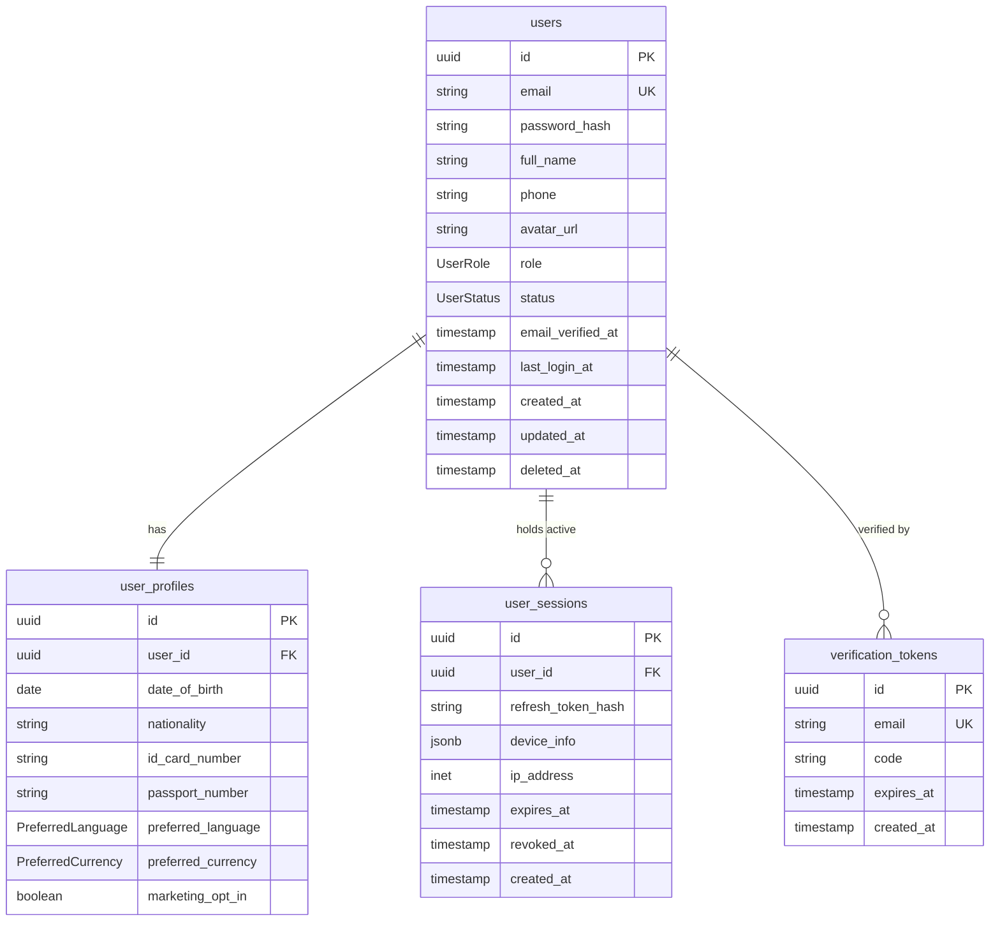

# Authentication Database Design

This document details the database schema, models, constraints, and relationships supporting the authentication feature, designed specifically for the PostgreSQL dialect and mapped using Prisma ORM.

---

## 📊 1. Entity Relationship Overview

The authentication feature relies on four primary tables:
* **`users`**: Contains primary account credentials, status, email, and role.
* **`user_profiles`**: Holds personal info and preferences (1:1 with `users`).
* **`user_sessions`**: Tracks active refresh tokens and device metadata (1:N with `users`).
* **`verification_tokens`**: Stores active registration, OTP verification, and password reset codes.



---

## 📝 2. Prisma Models Specification

### 2.1 User Model (`users`)
Stores credentials and system role. All other tables link to this table via Cascade delete settings.
```prisma
model User {
  id              String       @id @default(uuid()) @db.Uuid
  email           String       @unique
  passwordHash    String       @map("password_hash")
  fullName        String       @map("full_name")
  phone           String?
  avatarUrl       String?      @map("avatar_url")
  role            UserRole
  status          UserStatus
  emailVerifiedAt DateTime?    @map("email_verified_at")
  lastLoginAt     DateTime?    @map("last_login_at")
  createdAt       DateTime     @default(now()) @map("created_at")
  updatedAt       DateTime     @default(now()) @updatedAt @map("updated_at")
  deletedAt       DateTime?    @map("deleted_at")

  profile         UserProfile?
  sessions        UserSession[]

  @@map("users")
}
```

### 2.2 UserProfile Model (`user_profiles`)
Stores additional profile attributes. Linked in a **1:1 relationship** with `User`.
```prisma
model UserProfile {
  id                String            @id @default(uuid()) @db.Uuid
  userId            String            @unique @map("user_id") @db.Uuid
  user              User              @relation(fields: [userId], references: [id], onDelete: Restrict, onUpdate: Cascade)
  dateOfBirth       DateTime?         @map("date_of_birth") @db.Date
  nationality       String?
  idCardNumber      String?           @map("id_card_number")
  passportNumber    String?           @map("passport_number")
  preferredLanguage PreferredLanguage @default(vi) @map("preferred_language")
  preferredCurrency PreferredCurrency @default(VND) @map("preferred_currency")
  marketingOptIn    Boolean           @default(false) @map("marketing_opt_in")
  createdAt         DateTime          @default(now()) @map("created_at")
  updatedAt         DateTime          @default(now()) @updatedAt @map("updated_at")

  @@map("user_profiles")
}
```

### 2.3 UserSession Model (`user_sessions`)
Tracks active refresh tokens. Linked in a **1:N relationship** with `User`.
```prisma
model UserSession {
  id               String   @id @default(uuid()) @db.Uuid
  userId           String   @map("user_id") @db.Uuid
  user             User     @relation(fields: [userId], references: [id], onDelete: Restrict, onUpdate: Cascade)
  refreshTokenHash String   @map("refresh_token_hash")
  deviceInfo       Json?    @map("device_info")
  ipAddress        String?  @map("ip_address")
  expiresAt        DateTime @map("expires_at")
  revokedAt        DateTime? @map("revoked_at")
  createdAt        DateTime @default(now()) @map("created_at")

  @@map("user_sessions")
}
```

### 2.4 VerificationToken Model (`verification_tokens`)
Temporarily stores OTP codes for registration and password resets.
```prisma
model VerificationToken {
  id        String   @id @default(uuid()) @db.Uuid
  email     String   @unique
  code      String   // Contains JWT or OTP numeric code
  expiresAt DateTime @map("expires_at")
  createdAt DateTime @default(now()) @map("created_at")

  @@map("verification_tokens")
}
```

---

## 🔒 3. Foreign Key & Integrity Constraints
* **OnDelete: Restrict**: Deleting a `User` record is restricted if they have an active `UserProfile` or active `UserSession`. This ensures transaction history integrity. Soft delete is enforced using `deletedAt`.
* **OnUpdate: Cascade**: Updating the primary ID cascades changes immediately across all linked relational rows.
* **Email Uniqueness**: Unique database index on `users(email)` and `verification_tokens(email)` is strictly enforced at the SQL level.
