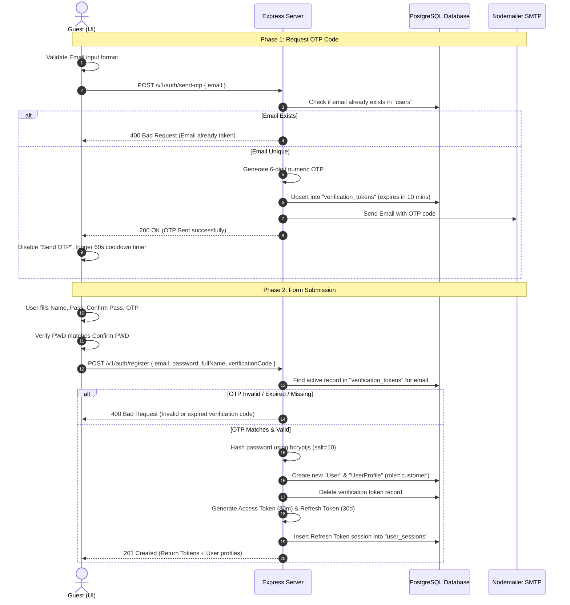
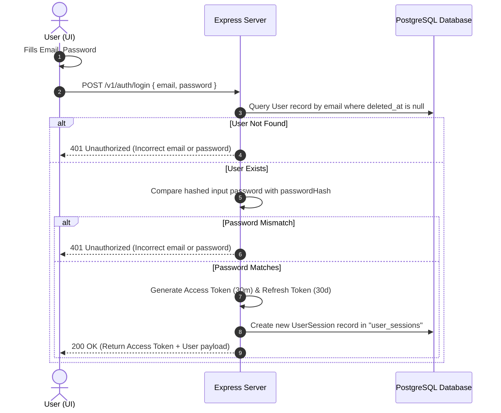
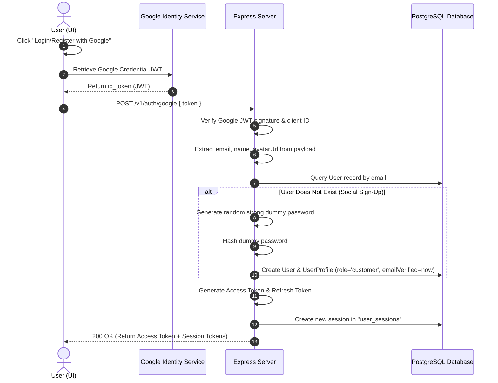
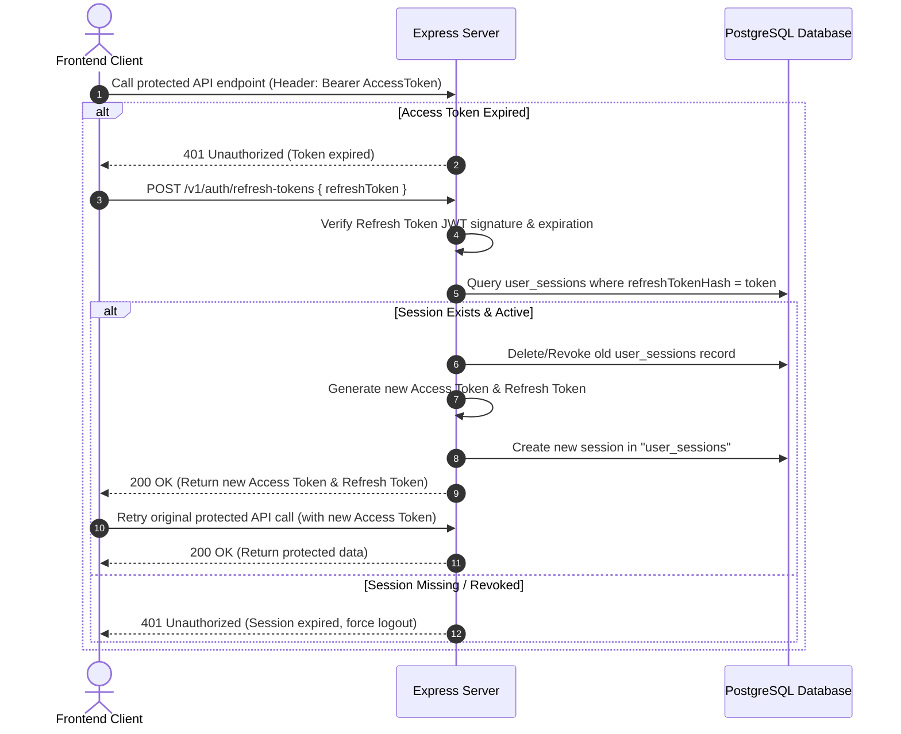

# Authentication System Flows

This document details the step-by-step logic and sequence of events for all key authentication flows: Registration, Login, Google OAuth, and Refreshing Tokens.

---

## 1. User Registration Flow (with Email OTP)

This flow details how a guest registers a new account using the OTP mechanism illustrated in the mockup.

---

## 2. Standard Login Flow (Email & Password)

This flow describes authentication using conventional email and password.

---

## 3. Google OAuth Social Authentication Flow

This flow covers automated sign-up and sign-in via Google Identity integration.

---

## 4. Silent Token Refresh Flow

This flow allows the frontend client to seamlessly refresh access tokens without user interruption.

